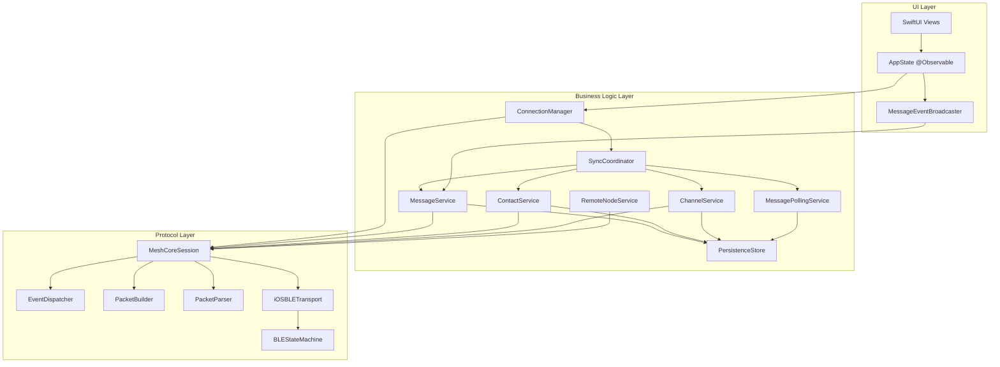

# PocketMesh Architecture

PocketMesh is built using a modern, three-tier modular architecture designed for high performance, reliability, and maintainability. It leverages Swift 6's strict concurrency model, actor isolation, and modern iOS frameworks.

## Platform Requirements

- **Target:** iOS 26.0
- **Minimum Deployment:** iOS 18.0
- **Swift:** 6.2+
- **Xcode:** 16.1+

## High-Level Architecture

The project is divided into three main layers:

1. **MeshCore (Protocol Layer)**: A pure Swift implementation of the MeshCore mesh networking protocol.
2. **PocketMeshServices (Business Logic Layer)**: Manages higher-level business logic, actor isolation, and shared persistence.
3. **PocketMesh (UI Layer)**: The SwiftUI-based user interface and application state management.

---

## 1. MeshCore (Protocol Layer)

The foundation of the project, responsible for low-level communication with MeshCore devices.

- **Actor-Based**: `MeshCoreSession` is an actor that serializes all device communication, ensuring thread safety.
- **Event-Driven**: Uses an `EventDispatcher` to broadcast `MeshEvent`s via `AsyncStream`.
- **Stateless Protocol Handlers**: `PacketBuilder` and `PacketParser` are stateless enums that handle the binary encoding/decoding of the Companion Radio Protocol.
- **Transport Abstraction**: The `MeshTransport` protocol allows for different underlying transports, such as `iOSBLETransport` (using CoreBluetooth with `BLEStateMachine`) or `MockTransport` (for unit testing).
- **LPP Telemetry**: Includes a full implementation of the Cayenne Low Power Payload (LPP) for efficient sensor data transmission.

See: [MeshCore API Reference](api/MeshCore.md) | [BLE Transport Guide](guides/BLE_Transport.md)

---

## 2. PocketMeshServices (Business Logic Layer)

Bridges the protocol layer and the UI, handling complex business rules and data persistence.

- **Service-Oriented**: Business logic is divided into specialized actors (`MessageService`, `ContactService`, `ChannelService`, `RemoteNodeService`, etc.).
- **Sync Coordination**: `SyncCoordinator` orchestrates the connection lifecycle and data synchronization through contacts, channels, and messages phases.
- **Actor Isolation**: Every service is an actor, protecting internal state and coordinating asynchronous operations safely.
- **Persistence**: Uses **SwiftData** for local storage. Data is isolated per device using the device's public key as a namespace.
- **Connection Management**: `ConnectionManager` (a `@MainActor` observable class) manages the lifecycle of the connection, including pairing via **AccessorySetupKit**, auto-reconnection, and service wiring.
- **Message Polling**: `MessagePollingService` pulls messages from the device queue and routes them to appropriate handlers.

See: [PocketMeshServices API Reference](api/PocketMeshServices.md) | [Sync Guide](guides/Sync.md) | [Messaging Guide](guides/Messaging.md)

---

## 3. PocketMesh (UI Layer)

A modern SwiftUI application that provides a user-friendly experience for mesh messaging.

- **AppState**: A central `@Observable` class that manages app-wide state, navigation, and coordination between the UI and services.
- **MessageEventBroadcaster**: Bridges service layer callbacks to SwiftUI's `@MainActor` context for real-time UI updates.
- **SwiftUI & Modern APIs**: Built with the latest SwiftUI features, utilizing `@Observable`, environment injection, and modern navigation.
- **Onboarding Flow**: A guided experience for permissions, discovery, and device pairing.
- **iMessage-Style Chat**: Rich messaging interface with delivery status, timestamps, and metadata (SNR, path length).
- **MapKit Integration**: Displays contact locations on a map with real-time updates and type-based markers.

See: [PocketMesh API Reference](api/PocketMesh.md) | [User Guide](User_Guide.md)

---

## Concurrency & Data Flow

### Concurrency Model

PocketMesh strictly adheres to the **Swift 6 concurrency model**:

- **Actors**: Used for all services and session management to prevent data races.
- **MainActor**: UI updates, `ConnectionManager`, and `MessageEventBroadcaster` are isolated to the main thread.
- **AsyncStream**: Used for all event-driven communication (BLE data -> Protocol events -> Business events -> UI updates).
- **Structured Concurrency**: Utilizes `TaskGroups` for complex asynchronous flows like message retries and contact synchronization.

### Data Flow (Receiving a Message)

1. **BLE Transport**: `BLEStateMachine` receives a notification from CoreBluetooth and yields the data to `iOSBLETransport`'s `receivedData` stream.
2. **Session Parser**: `MeshCoreSession` receives the data, uses `PacketParser` to create a `MeshEvent`, and dispatches it via `EventDispatcher`.
3. **Service Processing**: `MessagePollingService` receives the event, routes it to the appropriate handler based on message type.
4. **Persistence**: The handler creates a `MessageDTO` and saves it to `PersistenceStore`.
5. **UI Update**: `MessageEventBroadcaster` receives the callback, updates observable state, triggering SwiftUI view updates.

### Data Flow (Sending a Message)

1. **User Action**: User types message in `ChatView` and taps send.
2. **Service Call**: `MessageService.sendMessageWithRetry()` is called.
3. **Queue**: Message is saved to `PersistenceStore` with status `.queued`.
4. **Retry Loop**: `MeshCoreSession.sendMessageWithRetry()` attempts delivery (up to 4 times, switching to flood after 2).
5. **ACK Tracking**: `PendingAck` is created; background task checks for expiry.
6. **Completion**: ACK received -> `.delivered`, or all attempts exhausted -> `.failed`.

---

## Persistence Layer

- **Technology**: SwiftData
- **Isolation**: Each MeshCore device has its own isolated data store, ensuring privacy and preventing data mixing.
- **Models**:
  - `Device`: Metadata, radio parameters, and capabilities.
  - `Contact`: Public keys, names, types (Chat, Repeater, Room), and location data.
  - `Message`: Content, timestamps, delivery status, and mesh metadata (SNR, Path).
  - `Channel`: Slot-based configuration for group messaging.

---

## Further Reading

- [Development Guide](Development.md)
- [User Guide](User_Guide.md)

### API References
- [MeshCore API](api/MeshCore.md)
- [PocketMeshServices API](api/PocketMeshServices.md)
- [PocketMesh API](api/PocketMesh.md)

### Topic Guides
- [BLE Transport](guides/BLE_Transport.md)
- [Messaging](guides/Messaging.md)
- [Sync](guides/Sync.md)
